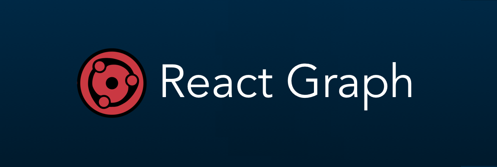
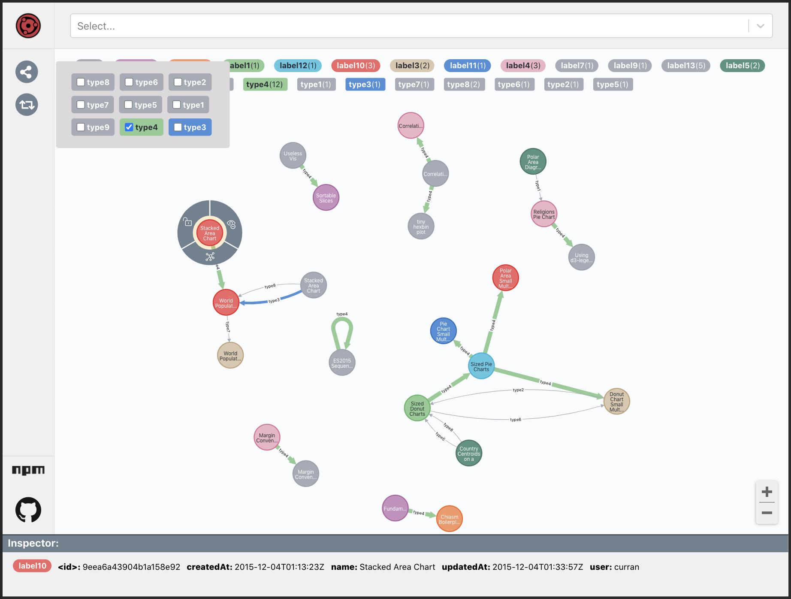

<!--- -->
# React Graph

Render dynamic graphs based on d3 models with [Neo4j data format](#neo4j-data-format).

[](https://www.npmjs.com/package/react-graph) [](https://standardjs.com)

## Live Demo
 - [Minimalist](https://how49.csb.app/ )
 - [Dashboard](https://c1fde.csb.app/)
 
 ## Dashboard View


## Installation

```bash
npm install react-graph  --save
```

## Usage

```js
import ReactGraph from 'react-graph';

export const Minimalist = (props) => (
 <ReactGraph
   initialState={props.initialState}
   nodes={props.nodes}
   relationships={props.relationships}
   hasTruncatedFields
   hasLegends
   hasInspector
 />
)
```
 - [Minimalist](https://github.com/jcarva/react-graph/blob/main/example/src/demos/minimalist/Minimalist.tsx)
 - [Dashboard](https://github.com/jcarva/react-graph/blob/main/example/src/demos/dashboard/Dashboard.tsx)

## Features

* Compaptible with [Neo4j data format](#neo4j-data-format).
* Complete and responsive [Dashboard](https://c1fde.csb.app/) to map your data.
* Info panel that shows nodes and relationships information on hover.
* Node menu on click.
* Custom node colors by node label. 
* Custom relationship colors by relationship type.
* Sticky nodes (drag to stick, single click to unstick).
* Dynamic graph update.   
* Zoom.
 
#### Neo4j data format
```js
{
    "results": [
        {
            "columns": ["user", "entity"],
            "data": [
                {
                    "graph": {
                        "nodes": [
                            {
                                "id": "1",
                                "labels": ["User"],
                                "properties": {
                                    "userId": "jcarva"
                                }
                            },
                            {
                                "id": "8",
                                "labels": ["Project"],
                                "properties": {
                                    "name": "react-graph",
                                    "title": "react-graph",
                                    "description": "Render dynamic graphs based on d3 models with Neo4j data format.",
                                    "url": "https://github.com/jcarva/react-graph",
                                    "mood": "https://youtu.be/dQw4w9WgXcQ"
                                }
                            }
                        ],
                        "relationships": [
                            {
                                "id": "7",
                                "type": "DEVELOPES",
                                "startNode": "1",
                                "endNode": "8",
                                "properties": {
                                    "from": 1470002400000
                                }
                            }
                        ]
                    }
                }
            ]
        }
    ],
    "errors": []
}
```
## Credits
Inspired and helped this awesome project.

### Projects
  - [neo4jd3.js](https://github.com/eisman/neo4jd3)
  - [Disjoint Force-Directed Graph](https://observablehq.com/@d3/disjoint-force-directed-graph)
  - [Neo4j](https://github.com/neo4j)
  
### People
  - [Nicolò Taddei](https://github.com/taddei)
  - [Eddy Hernandez](https://github.com/eddywashere)

## License

GPLv3 &#127279; [jcarva](https://github.com/jcarva/react-graph/blob/main/LICENSE)
